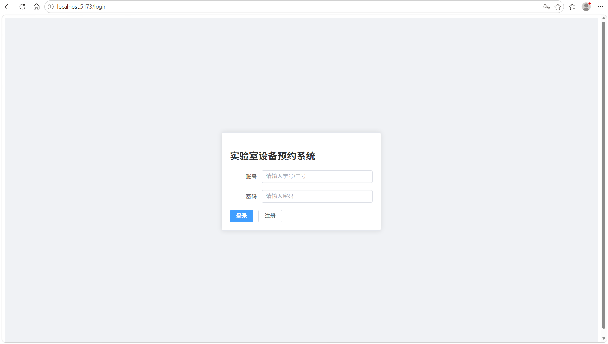
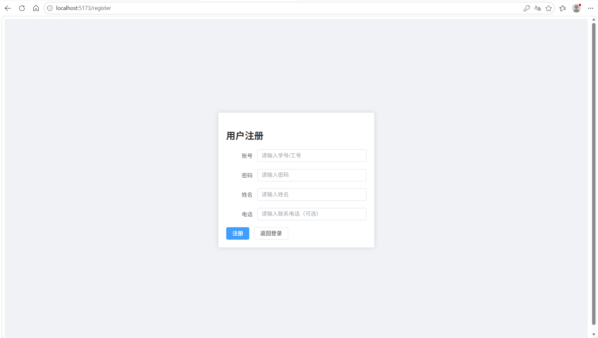
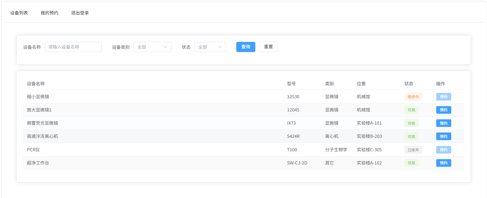
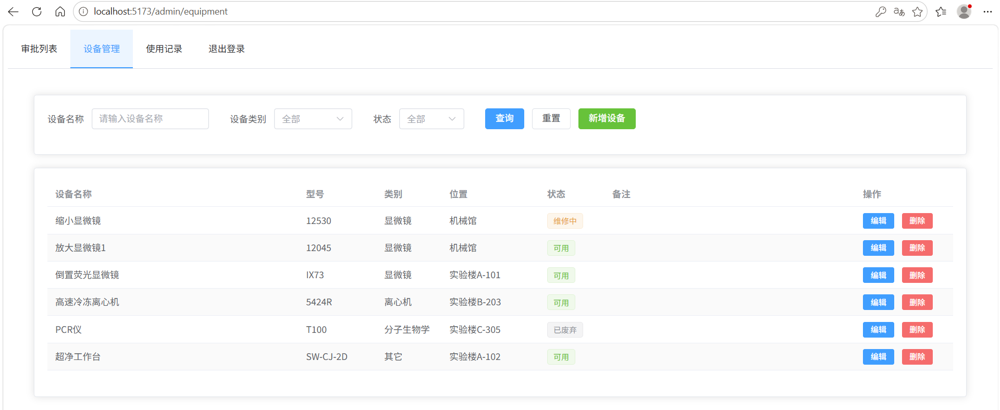
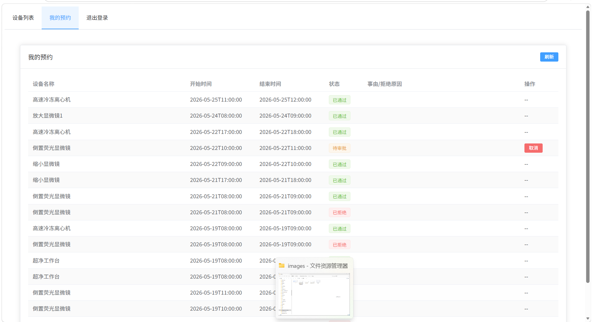
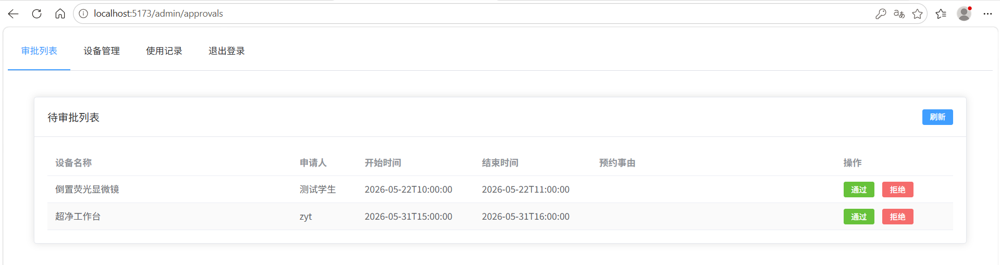
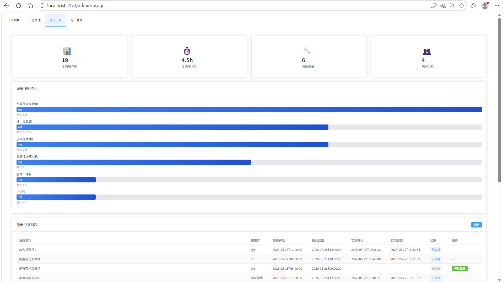

# lab-equipment-booking

实验室设备预约系统 - 学生可预约设备，管理员审批并查看使用记录。

## 技术栈声明

| 层级 | 技术 |
|------|------|
| 后端 | Spring Boot 3.5.14 + MyBatis-Plus 3.5.5 + JWT |
| 前端 | Vue 3 + Vite + Element Plus + Axios + Vue Router |
| 数据库 | MySQL 8.x |
| 中间件 | Redis（本项目已配置但未使用） |

## 环境要求

- JDK 17+
- Node.js 18+

## 本地部署步骤

### 1. 数据库初始化

**方式一**：执行 SQL 脚本

```sql
CREATE DATABASE lab_booking;
USE lab_booking;
-- 执行 doc/sql/schema.sql 建表
-- 执行 doc/sql/data.sql 初始化测试数据
```

**方式二**：执行 PowerShell 脚本

```powershell
.\run_sql.ps1
```

### 2. 启动 Redis（可选）

```bash
redis-server
```

> 保持窗口运行，或安装为 Windows 服务

### 3. 后端启动

```bash
cd backend
```

> 修改 `src/main/resources/application.yml` 中的数据库账号密码
> 默认配置：`username=root`, `password=Zyt041109`

**方式一（IDE）**：运行主类

```
EquipmentBookingApplication.java
路径：D:\lab-equipment-booking\backend\src\main\java\com\lab\equipment_booking\EquipmentBookingApplication.java
```

**方式二（命令行）**：

```bash
mvn spring-boot:run
```

### 4. 前端启动

```bash
cd frontend
npm install
npm run dev
```

访问 http://localhost:5173

### 5. 测试账号

| 角色 | 用户名 | 密码 |
|------|--------|------|
| 管理员 | admin | 123456 |
| 普通学生 | 20240001 | 123456 |

## 项目结构

```
lab-equipment-booking/
├── backend/                         # 后端代码
│   ├── src/main/java/               # Java 源代码
│   │   ├── controller/              # 控制器层
│   │   ├── service/                 # 服务层
│   │   │   ├── impl/                # 服务实现
│   │   ├── mapper/                  # 数据访问层
│   │   ├── entity/                  # 实体类
│   │   ├── dto/                     # 数据传输对象
│   │   └── utils/                   # 工具类
│   ├── src/main/resources/          # 配置文件
│   │   ├── application.yml          # 应用配置
│   │   └── mapper/                  # MyBatis XML
│   ├── src/test/java/               # 测试代码
│   │   ├── controller/              # 控制器测试
│   │   └── service/                 # 服务测试
│   └── pom.xml                      # Maven 依赖配置
├── frontend/                        # 前端代码
│   ├── src/                         # Vue 源代码
│   │   ├── views/                   # 页面组件
│   │   ├── components/              # 通用组件
│   │   ├── router/                  # 路由配置
│   │   ├── utils/                   # 工具函数
│   │   └── assets/                  # 静态资源
│   ├── package.json                 # npm 依赖配置
│   └── vite.config.js               # Vite 构建配置
├── doc/                             # 文档目录
│   ├── sql/                         # 数据库脚本
│   │   ├── schema.sql               # 建表脚本
│   │   └── data.sql                 # 测试数据
│   └── images/                      # 项目截图
└── README.md                        # 项目说明文档
```

## 数据库表

| 表名 | 说明 |
|------|------|
| user | 用户表（包含学生和管理员） |
| equipment | 设备信息表 |
| reservation | 预约记录表 |
| usage_record | 设备使用记录表 |

## 功能模块

- **用户管理**：登录、注册、身份鉴权（学生/管理员）
- **设备管理**：设备 CRUD、列表查询（支持按类别、状态筛选）、状态管理（可用/维修中/已废弃）
- **预约管理**：学生查看可预约时段、提交预约、取消预约、时间冲突校验
- **审批模块**：管理员审批预约（通过/拒绝）、查看待审批列表、违规管理
- **使用记录**：设备使用记录生成（支持自动/手动方式）、历史查询、按时长统计、超时释放

## 说明

- 后端端口默认 **8080**，前端端口默认 **5173**
- 数据库名称为 **lab_booking**
- 数据库连接配置在 `application.yml` 中，默认用户名 **root**，密码 **Zyt041109**
- 测试账号密码默认为 **123456**

> **注意**：启动后端前请确保 MySQL 服务已运行

## 集成测试

### 测试覆盖

- **服务层测试**：UserServiceTest, EquipmentServiceTest, ReservationServiceTest
- **控制器层测试**：UserControllerTest, EquipmentControllerTest, ReservationControllerTest

### 运行测试

在 IDE 中直接运行测试类即可。

### 测试报告

所有测试使用 `@Transactional` 注解确保测试隔离性，使用 `@DisplayName` 注解提供友好的测试名称。

## 项目截图

### 登录页面


### 用户注册


### 设备列表


### 设备管理


### 我的预约


### 审批管理


### 使用记录

